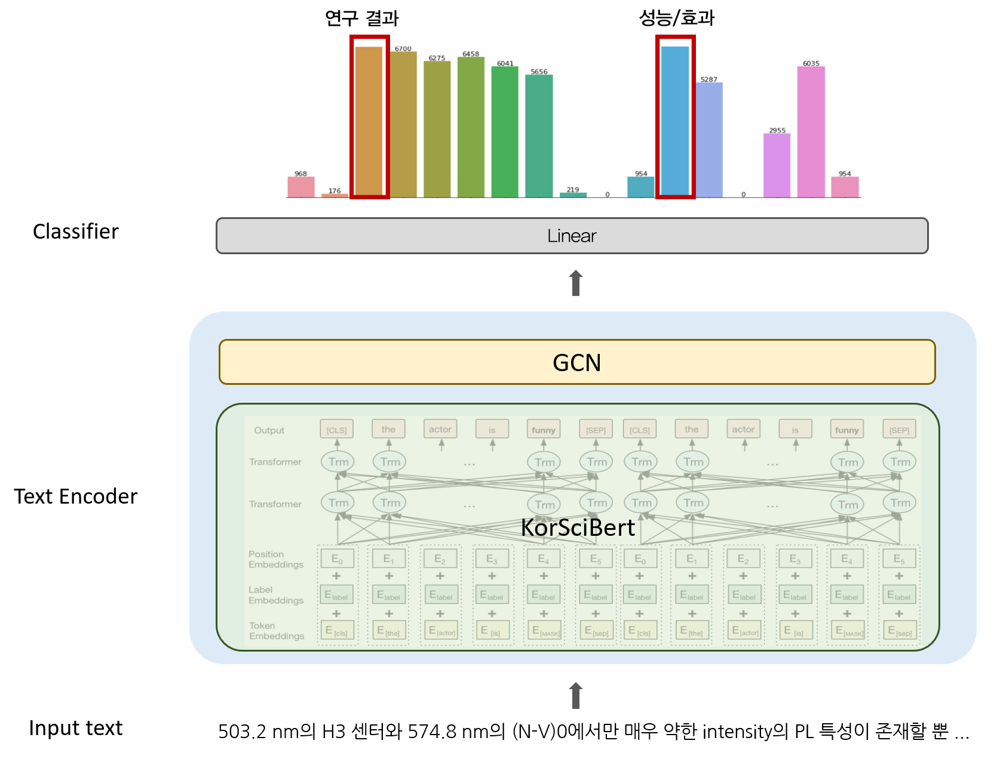

# Development of domestic thesis sentence semantic tagging model

### Overview
- To automate the meaning tagging of the domestic thesis sentence by predicting the rhetorical category of a thesis sentence.
- Hierarchical embedding structure and multiple loss functions are used to represent the meaning of rhetorical categories.

### Framework & Training Scheme
The overall architecture of the proposed method is as below:



The training mechanism of the proposed method is as below:


### Training Environment
- python 3.7
- pytorch 1.8.0
- Ubuntu 18.04
- CUDA 11.1
- GeForce RTX 3090

### Directory Structure
```
/root/workspace
├── data
│    ├── hierar
│    │    ├── hierar_prob.json
│    │    ├── hierar.txt
│    │    ├── label.dict
│    │    ├── label_i2v.pickle
│    │    └── label_v2i.pickle
│    │    
│    ├── tagging_data.csv
│    └── label_desc.csv
│
├── src
│    ├── models
│    │    ├── pretrained_model
│    │    │    └── korscibert
│    │    │         ├── bert_config_kisti.json
│    │    │         ├── pytorch_model.bin
│    │    │         ├── tokenization_kisti.py
│    │    │         └── vocab_kisti.txt
│    │    │   
│    │    ├── structure_model
│    │    │    ├── graphcnn.py
│    │    │    ├── structure_encoder.py
│    │    │    └── tree.py
│    │    │    
│    │    ├── matching_network.py
│    │    ├── model.py
│    │    └── text_feature_propagation.py
│    │   
│    ├── utils
│    │    ├── configure.py
│    │    ├── evaluation_modules.py
│    │    ├── hierarchy_tree_stastistic.py
│    │    ├── train_modules.py
│    │    └── utils.py
│    │  
│    ├── construct_label_desc.py
│    ├── config.json
│    ├── dataloader.py
│    ├── main.py
│    └── trainer.py
│
├── 매뉴얼.txt
├── sen_cls.yaml
└── README.md
```

### How to Use

1. Create Environment & Import Library
    ```
    conda env create -f sen_cls.yaml
    conda activate sen_cls
    pip install torch==1.8.0+cu111  -f https://download.pytorch.org/whl/torch_stable.html
    ```

2. Training
   ```
   python main.py --do_train=True --exp_num='exp' --fold=0
   ```

3. Test
   ```
   python main.py --do_test=True --exp_num='model_0fold' --fold=0 
   ```

4. Predict
   ```
   python main.py --do_predict=True --exp_num='model_0fold' --fold=0  
   ```

### Arguments
- `--config_path` : parameter config
- `--exp_num` : location of trained model
- `--do_train` : whether to execute the training phase
- `--do_test` : whether to execute the testing phase
- `--do_predict` : whether to execute the prediction
- `--fold` : setting for validation fold

### Results
We provide visualizations of embedding space for test set. They are predicted by KorSciBERT and KorSciBERT with GCN and matching loss. This indicates that our proposed method can separate domestic thesis sentences according to their meanings.


